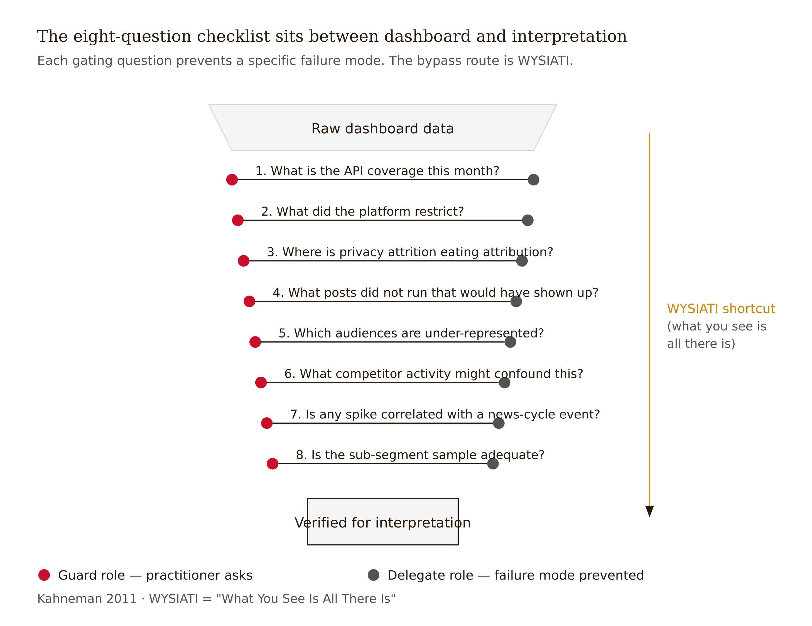

# Chapter 5 — Analytics & Reporting

*Data pull, descriptive stats, anomaly flagging vs. causal interpretation, strategic read*

---

In April 2010, Pepsi shifted roughly $20 million of its Super Bowl advertising budget to the Pepsi Refresh Project — a community-voted grants program tracked through social engagement. The metrics were spectacular. Tens of millions of votes, hundreds of thousands of project submissions, sustained engagement curves that competitors could not match. Inside the dashboard, the campaign was a success on every visible axis.

Inside the market-share data, Pepsi fell out of the top two soda brands for the first time in roughly two decades. Diet Coke overtook it for the number-two position. The strategy was discontinued by 2012.

The case is taught regularly now because the failure is not a measurement failure. The dashboard showed exactly what was happening at the dashboard's layer. The engagement numbers were real. What they were not was evidence that anything was working. The failure was at the interpretive layer: the team read the engagement curve as a brand-strength signal when it was something narrower — a brand-affinity-of-a-particular-kind signal that did not transfer to purchase. AI tooling in 2026 produces dashboards with more numbers, more confident summaries, and more fluent paragraphs than Pepsi's analysts had in 2010. The Pepsi Refresh failure is exactly the failure shape an "AI Insights" panel encourages today.

The honest version of what this chapter is about: AI tells you what happened. Only you can tell the room why it matters. The two activities feel similar from the outside. They are not similar at all.

---

## A Ladder Worth Climbing

Judea Pearl, in *Causality* (2009) and the more accessible *The Book of Why* (2018, with Dana Mackenzie), describes three rungs of inferential work. The first rung is association: what patterns co-occur? Reels and follower growth rose together this month. The second rung is intervention: what happens if I act? If I posted more Reels, would follower growth rise? The third rung is counterfactual: what would have happened otherwise? Would follower growth have risen this month even without the Reels?

These three rungs are not interchangeable. Moving from rung one to rung two requires an intervention test — you have to have actually tried changing the variable, or constructed something close enough to that. Moving from rung two to rung three requires modeling what the world looks like under a different history. Both moves demand evidence that association alone cannot supply.

Almost every "AI insight" produced by current social media tooling lives entirely on rung one. The output reads as if it lives on rungs two or three. The wording is fluent, action-oriented, often imperative: *Reels are driving your follower growth — increase Reels production.* Underneath that sentence is a correlation, sometimes a weak one, with no intervention test, no counterfactual analysis, and no consideration of confounders. The summary is rung-one work dressed in rung-two language.

This is the trap to name before you open any analytics platform. Not because the tools are dishonest, but because fluent language implies more than association, and the tools produce fluent language. The practitioner who knows Pearl's ladder can read every AI-generated insight as a hypothesis and ask which rung the evidence actually occupies. The practitioner who does not know the ladder reads the fluent paragraph as a conclusion.

---

## What the Tools Do Well

The pattern-shaped work in analytics is substantial, and it is worth being precise about what it includes, because under-delegating here is a real cost.

Data aggregation across APIs: pulling from Meta, TikTok, LinkedIn, X, YouTube, and whatever proprietary tools the organization pays for, normalizing fields, handling the routine breakage when a platform changes a field name. This is boring work that was genuinely time-consuming as recently as five years ago. It is now cheap and reliable enough to delegate almost completely — with one exception: spot-check the aggregation against one platform's native export. Field-mapping breakage is the primary way AI produces hallucinated numbers with complete confidence.

Descriptive statistics: engagement rates, reach, impressions, follower deltas, posting-time distributions, format performance, hashtag co-occurrence, week-over-week changes. The basic shape of what happened. All of this is rung-one work, and rung-one work is what these tools are built for.

| Task | Why it is pattern-shaped | The one spot-check that keeps it honest |
| --- | --- | --- |
| Cross-API data aggregation | Field-mapping and normalization across Meta, TikTok, LinkedIn, X, YouTube is rule-governed plumbing | Reconcile one platform's totals against its native export each month |
| Descriptive statistics | Means, distributions, week-over-week deltas, format breakdowns are mechanical | Verify the denominator on engagement rate matches the rate the platform reports |
| Posting-time and format distributions | Histogram-shaped summaries over a fixed taxonomy | Confirm post taxonomy matches what the team actually shipped |
| Anomaly flagging | Statistical-process-control on a rolling window scales without human effort | Re-classify a sample of flags by hand and check the false-positive rate |
| Aggregate sentiment classification | Volume tasks tolerate model error that single-post reads cannot | Sample 30 posts across registers (sarcasm, AAVE, in-group code) and audit |
| Hashtag and co-occurrence mining | Counting and clustering is what these tools are built for | Sanity-check the top cluster against the actual posts that drove it |
| First-pass chart captions and boilerplate | Boilerplate scales; the strategic narrative does not | Read every caption against the chart before the report ships |

*Figure 5.1 — Delegate list for analytics: pattern-shaped tasks and the spot-check each one earns.*

<!-- → [TABLE: Delegate List for analytics — tasks, why pattern-shaped, the one spot-check that keeps each honest] -->

Anomaly flagging: spikes, dips, format outliers, sudden sentiment shifts. Statistical-process-control style monitoring on a rolling window. AI is genuinely good at this, and it was genuinely painful as a manual task before. The flag is useful. The interpretation of the flag is not the tool's job.

Sentiment classification in aggregate: useful on volume, reliably weaker on sarcasm, code-switching, in-group language, AAVE, queer code, non-English content, and community-specific irony registers. The aggregate trend is delegable. The per-post read is judgment.

First-pass report drafting: the boxes, the bullets, the chart captions, the boilerplate summary paragraphs. This is real work. Delegating it matters. The strategic narrative is not the boilerplate; the boilerplate is what the strategic narrative sits on top of. Both matter, and only one of them is the analyst's scarce resource.

The rough heuristic: anything that ends in "and here is the chart" is delegable. Anything that begins with "what this means is" is not.

---

## What the Tools Cannot Do

The judgment-shaped work in analytics begins where the rung-one description ends — which is to say, it begins at the point that matters most for decisions.

The causal interpretation. This is Pearl's rung two and three, and it is where the Pepsi Refresh failure lived. "Reels drove your growth" is an association, not a cause. The confounders are invisible to the dashboard: was your CEO on a podcast that week? Did a competitor get occupied with a product recall? Did the algorithm shift for reasons that had nothing to do with your content strategy? The model surfaces the correlation. The practitioner names the confounders.

The competitive-context read. The same data point means three different things in three different competitive contexts. A share-of-voice spike that looks like organic growth may be the consequence of a competitor's silence, a competitor's crisis, or a news cycle that happened to mention your brand. AI does not know which. Reading the competitive context is grounded in industry knowledge that does not fit in a brief.

| Judgment task | What AI produces instead | What the human supplies |
| --- | --- | --- |
| Causal interpretation (Pearl rung 2/3) | Fluent rung-two language wrapped around rung-one correlations | Confounders, intervention tests, counterfactual framing |
| Competitive-context read | A share-of-voice number with no story behind it | Knowledge of competitor silence, crisis, news cycle |
| Naming what is not in the data | A confident summary that smooths over gaps | Survivorship, bot inflation, attribution attrition — named explicitly |
| Deming common- vs. special-cause call | A flag fired on every anomaly | Recognition that stable variation does not warrant a response |
| Cultural-political read | A positive sentiment score on a tone-deaf post | Memory of what the audience has been through this week |
| Strategic narrative | Paragraphs describing the numbers | Paragraphs describing the situation and the next move |
| Inaction recommendation | A default ramp-up suggestion on the flagged metric | The judgment that no action is the correct response this month |

*Figure 5.2 — Guard list for analytics: judgment tasks, the artefact AI returns, the human contribution.*

<!-- → [TABLE: Guard List for analytics — judgment tasks, what AI produces instead, what the human supplies] -->

Naming what is not in the data. This is the analyst's first responsibility and the one AI most consistently fails. Survivorship bias: the posts, accounts, and signals visible in your dataset are the ones that survived moderation, algorithmic boost, and your own filters. The posts that never ran, the accounts that were suspended, the segments the platform under-counts — none of these are in the data. Bot inflation: HypeAuditor and CreatorIQ have documented through 2020–2024 how bot activity and pod behavior have broken engagement rate as a cross-account comparison metric. Attribution attrition: post-iOS 14.5 in April 2021 and the privacy-shift arc, attribution chains are fragmentary. AI attribution models smooth over the gaps; the smoothing is invisible to the dashboard reader. AI extrapolates confidently over all of these absences. The honest move is to name them explicitly before any interpretation begins.

The Deming discipline. W. Edwards Deming's principle, articulated in *Out of the Crisis* (1982), is that most variation in a stable system is common-cause noise — routine, system-internal variation — and reacting to it makes the system worse. He demonstrated this with the Red Bead Experiment: workers who adjusted their process in response to random variation produced worse outcomes than workers who left it alone. Most weekly engagement reporting is a Red Bead Experiment with a logo on it. AI defaults to suggesting action on every flagged anomaly. The judgment move is recognizing when the system is stable and the variation does not warrant a response.

The cultural-political read. In June 2020, hundreds of brands posted black squares within a 72-hour window in response to the murder of George Floyd. AI sentiment classifiers largely scored these posts as generating positive engagement. The interpretive read — that many of these posts were brand-damaging because of the visible gap between the performed solidarity and any organizational follow-through — required context the classifiers could not have. The gap between what the post said and what the organization did is not visible in the engagement data. It is visible to anyone who was watching.

The strategic narrative. A monthly report is a story about what is happening, why, and what to do about it. AI writes fluent paragraphs that describe the numbers. The practitioner writes paragraphs that describe the situation. These two things read alike on first pass and diverge in the meeting where the budget decision actually gets made.

---

## What the Checklist Is For

Before any interpretation, eight questions asked every time:

What is the API coverage this month? What did the platform restrict? Where is privacy attrition eating attribution? What posts did not run that would have shown up in a different month? Which audience segments are systematically under-represented in the data? What competitor activity might confound any apparent share-of-voice move? Is any spike correlated with a news-cycle event the brand did not create? What is the sample size for any sub-segment claim, and is it adequate?

*Figure 5.3 — The eight-question checklist as a pre-interpretation filter.*

<!-- → [INFOGRAPHIC: The eight-question "what isn't here" checklist as a pre-interpretation protocol — each question paired with the specific failure mode it prevents] -->

This checklist is not a formality. It is the structural antidote to WYSIATI — Daniel Kahneman's diagnostic from *Thinking, Fast and Slow* (2011) for the System-1 trap of treating the available information as the complete information. An AI-generated dashboard summary is a System-1 prompt. It presents the available data fluently and completely, which creates the impression that the available data is the complete picture. The checklist forces the System-2 question: what is the picture missing?

The Pepsi Refresh team had access to the engagement data. They did not run a version of this checklist. The question they did not ask was something like: is this engagement signal correlated with purchase intent, or is it a different kind of brand engagement that does not predict purchase? That question is not on any dashboard. It has to be brought to the dashboard by a practitioner who knows to ask it.

---

## Two Reports, Same Month

Here is the most useful thing I can show you. Same month, same data, two different executive summaries.

The AI-generated version:

> Engagement was up 12% month-over-month, driven by strong performance from Reels and short-form video. Top-performing post categories include behind-the-scenes content and product launches. Recommend increasing Reels frequency and continuing to invest in short-form video to maintain momentum into next quarter.

The practitioner-written version:

> Engagement rose 12% but the rise is concentrated in a single viral Reel from week two — a CEO interview clip organically resurfaced by an industry account. Strip that post and engagement was flat. The Reels-as-format story is not supported by the rest of the month's data. Recommendation: do not staff up on Reels production based on this month. Investigate what made the CEO clip travel — it looks like the kind of moment we cannot manufacture but should be ready to amplify when it happens organically.

The first summary is fluent and wrong in the direction of expensive action. It takes a rung-one finding — Reels and engagement rose together — and presents it as a rung-two recommendation: increase Reels production. The evidence does not support the move. One viral post is not a format strategy.

The second summary is awkward and right. It does the work the analyst is actually paid to do: look past the aggregate, find the outlier that is driving the number, and tell the room what the number would look like without the outlier. Then it gives a recommendation grounded in what the data actually shows — which is that the right next move is investigation, not production ramp.

*Figure 5.4 — Two summaries, same month: rung labels and the moves that make the practitioner version honest.*

<!-- → [IMAGE: Side-by-side visual of the two executive summaries, annotated — AI version with rung labels showing where rung-one evidence has been rephrased as rung-two recommendation; practitioner version with annotations showing the moves that make it honest] -->

Vosoughi, Roy, and Aral's 2018 *Science* paper documented that false stories travel faster, deeper, and more broadly than true ones on social platforms. The implication for analytics: an engagement spike that looks like organic interest may be the signature of a misinformation cascade attached to your brand. The AI surfaces the spike. The judgment about whether it is interest or contamination is the analyst's. Fluency is not a detection mechanism for this problem. Only context is.

---

## The Reporting Protocol

A working protocol for the monthly report.

Specify the questions before pulling the data. Write down the three to five questions the report needs to answer for the audience that will read it. Did the new Reels strategy work? Should the LinkedIn paid spend stay at current levels? Is the competitor's new product affecting share of voice? Questions discipline the analysis. Without them you are dashboard-watching.

Use AI for the full descriptive layer. Aggregation, normalization, means, distributions, week-over-week deltas, format breakdowns, anomaly flags, first-draft chart captions. This is rung-one work. Let the tool do it.

Run the eight-question checklist before writing a single interpretive sentence. The checklist is the structural separation between description and interpretation. Do not skip it under deadline pressure. Deadline pressure is when the checklist matters most.

Write the interpretation yourself. The strategic-read paragraphs are human work. AI can produce a draft of what happened; the "why it happened" and "what we should do about it" paragraphs are the part that justifies the analyst's role.

Apply the rung-test before any recommendation. For every recommendation the report makes, ask: is this an association claim, an intervention claim, or a counterfactual claim? If it is presented as rung two or three but the evidence is rung one, downgrade the language. "Reels are correlated with follower growth this month" is honest. "Increase Reels production to drive follower growth" is rung-two language on rung-one evidence.

Mark every contested interpretation. Where the data could support more than one read, name the alternatives. The analyst's authority comes from naming uncertainty, not from suppressing it.

---

## The +1

Florence Nightingale's coxcomb diagrams, presented to British military commanders in 1858, were not descriptions of data. They were arguments built from data, designed to make commanders see what they had been ignoring — that more soldiers were dying from preventable infection than from battlefield wounds. The choice of visual form, the choice of what to compare, the choice of what question to make answerable: these were all Nightingale's. The data did not arrange itself into an argument. She arranged it.

The analyst's +1 in 2026 is the same function. The dashboard is not the argument. The practitioner builds the argument from the dashboard.

What that means concretely: the selection of which metric to track and which to deprecate. AI optimizes whatever metric you specify; the choice of metric is upstream of the optimization and carries an implicit theory of the business. The contextual read of what is happening in the industry and on the account that the dashboard cannot see. The discipline of naming the missing data — the survivorship filter, the bot baseline, the privacy attrition — before any interpretation begins. The Deming judgment about whether the variation warrants a response at all. And the willingness to recommend inaction, which is the hardest recommendation to make and the one most frequently correct.

John Tukey's argument in *Exploratory Data Analysis* (1977) is that the analyst's eye on the data — not the summary statistic — is where insight comes from. AI generates the summary. The eye is yours. The summary without the eye is the Pepsi Refresh outcome: a dashboard full of correct numbers and a strategy pointing in the wrong direction.

Chris Anderson argued in a 2008 *Wired* essay that with enough data, correlation is sufficient and theory becomes optional. The current generation of AI insights panels implicitly endorses that view. The practitioners who have been working through the 2020–2026 period have seen the consequences in their own dashboards: more confident summaries, more fluent recommendations, and the same strategic errors that fluency has always enabled when it runs ahead of evidence. Danah boyd and Kate Crawford's 2012 paper "Critical Questions for Big Data" is the corrective: more data without context produces more confidently wrong conclusions, not better conclusions.

The dashboard tells you what happened. Only you can tell the room why it matters. That sentence is not a consolation for the limits of AI. It is a description of what the job actually is.

---

## LLM Exercises

**Exercise 1 — Rung Classification**
Take three AI-generated "insight" sentences from any analytics tool you use — your platform's native insights panel, a third-party tool, or a ChatGPT-generated summary of a data export. For each sentence, identify which rung of Pearl's ladder the evidence actually supports versus which rung the language implies. Where do you find rung-one evidence in rung-two or rung-three language? Rewrite each sentence to match the evidence.

**Exercise 2 — The Eight-Question Checklist**
Pull a recent monthly report — yours or a published case study. Run the eight-question "what isn't here" checklist against it. For each question: did the report name this gap? If not, how would naming it change the interpretation of the report's main findings?

**Exercise 3 — Two Summaries**
Take a month of your own data and write two executive summaries: first, generate one using an AI tool with minimal guidance; second, write one yourself after running the rung-test and the eight-question checklist. Compare them. Where does the AI version use rung-two language on rung-one evidence? Where does your version name uncertainty the AI version suppresses?

**Exercise 4 — The Deming Judgment**
Identify three consecutive months of a single metric from your own or a publicly available brand's reporting. For each week-over-week change, classify the variation as likely common-cause noise or likely special-cause signal. On how many of the flagged changes would a Deming-informed practitioner have recommended action? On how many would they have recommended leaving the system alone?

---

## Prompts

**Figure 5.3 — Eight-question checklist (INFOGRAPHIC).** Render a vertical funnel that opens at the top into a band labelled "raw dashboard data" and narrows through eight horizontal cross-bars, each cross-bar a single gating question. Place a Guard marker (red `#C8102E` filled circle) at the left end of every bar and a Delegate marker (secondary `#545454` filled circle) at the right end naming the failure mode the question prevents. Emerge at the bottom into a rectangle labelled "verified for interpretation." Run a parallel ochre `#C8860E` bypass arrow alongside the funnel to mark the WYSIATI shortcut that skips the checklist. Ink axes, hairlines `#D4D4D4`, `#F5F5F5` plot fill, no rounded corners, no gradients.

**Figure 5.4 — Two summaries, same month (IMAGE).** Render two equal-size panels separated by a vertical hairline. Left panel: AI-generated summary as boilerplate hairlines stacked vertically, capped by a red-inked recommendation block and an upward-sweep ochre arrow into a question-mark dot at the tip. Annotate with `Evidence: rung 1 — association` in JetBrains Mono and `Language: rung 2 — intervention` in red. Right panel: practitioner summary as descriptive lines with a single red X-mark at the viral-Reel outlier, a short flat-baseline arrow labelled "engagement was flat," and a magnifying-glass icon paired with "recommend: investigate, not staff up." Annotate as `Evidence: rung 1` / `Language: rung 1`. Footer band reads "SHARED DATA: Engagement +12% MoM · driver concentrated in one week-two Reel · CEO interview resurfaced organically." Red encodes only the AI panel's mis-rung recommendation and the outlier strike.
